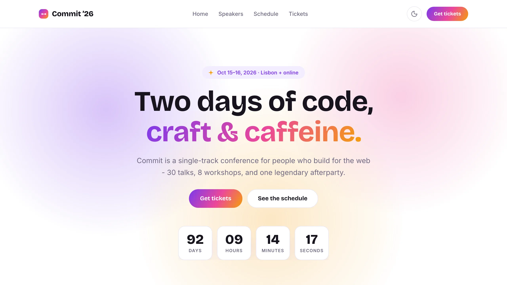
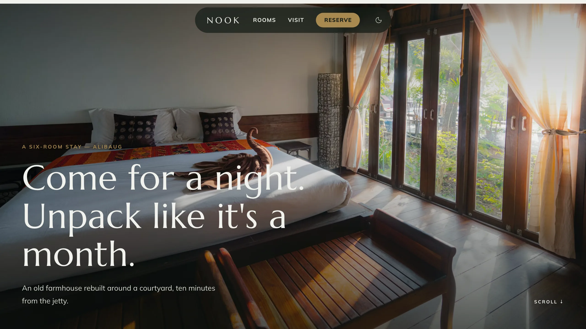
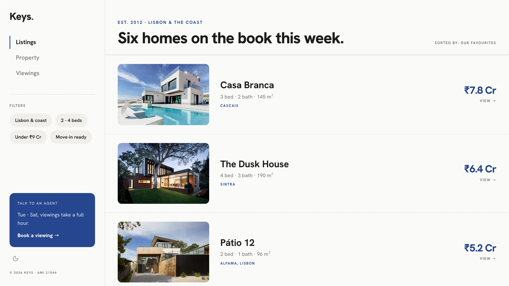
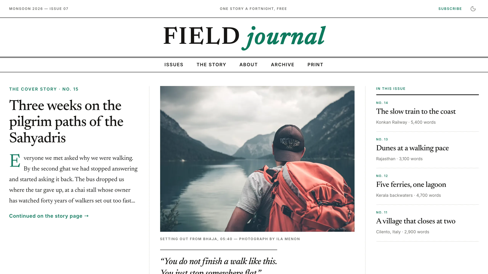
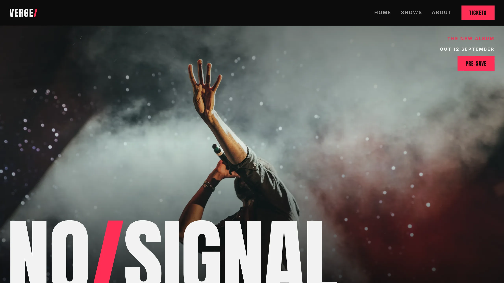

# Builder Hub

A centralized hub of [Frappe Builder](https://github.com/frappe/builder) page templates
(and, in future, plugins and components). Builder sites fetch the catalog and per-page
bundles from a Builder Hub site over HTTP, so templates get their own release cycle -
users always get the latest without upgrading the builder app.

Each template is a real Builder Page (`is_template = 1`) grouped under a `template_group`,
sharing a set of Builder Components and Variables. Groups are bundled as fixtures under
`builder_hub/builder_templates/<group>/` and synced into the hub site on install/migrate.

## Templates

Twelve multi-page template groups. Each has a shared navbar/footer + theme
across its pages, with a built-in light/dark toggle (except Verge, which is
single-theme dark by design).

Each group carries one picker category in its `template.json` manifest:
**Marketing** (Fronds, Commit, Verge), **Portfolio** (Atelier, Mono, Husk, Verso),
**Editorial** (Quill, Field), and **Local business** (Lull, Nook, Keys).

### Fronds

An earthy multi-page starter for boutique brands.


**Pages:** Landing · About · Contact
---
### Atelier

A bold studio site for agencies and freelancers: oversized type, a geometric inline-SVG
hero, a services index, a selected-work grid, and a built-in contact form.


**Pages:** Home · Work · Contact
---
### Mono

A dark, bold-type portfolio for studios and freelancers.


**Pages:** Home · Project (case study) · About · Contact
---
### Verso

An ultra-minimal personal site: a fixed left sidebar, typographic lists instead of cards,
and a near-monochrome palette.


**Pages:** Home · Work · Writing · About
---
### Husk

An ultra-minimal, warm-toned personal site with a centered single column and a slim nav.


**Pages:** Home · Work · About
---
### Quill

A clean editorial template for blogs and publications: a featured story, a typographic
article index, and a full reading layout with pull-quotes and an author note.


**Pages:** Home · Article · About
---
### Commit

A vivid conference starter with an animated hero and live countdown, a speaker grid, a
two-day schedule, and ticket tiers. Ships with scroll-reveal and marquee client scripts.



**Pages:** Home · Speakers · Schedule · Tickets
---
### Lull

A soft, symmetric wellness studio: an arch-shaped hero photo the headline wraps
around, circle-thumb offering rows, a weekly schedule, pricing and FAQs.
DM Serif Display + DM Sans on blush and sage.


**Pages:** Home · Classes · Visit
---
### Nook

A photo-first boutique stay: a floating pill nav over a full-viewport hero, rooms
as full-bleed chapters with roman numerals and floating info cards, and a
getting-here page. Marcellus + Mulish with a brass accent.



**Pages:** Home · Rooms · Visit
---
### Keys

An app-shell property agency: a fixed left sidebar with nav, filter chips and an
agent card, listings as horizontal rows, a property page with gallery and fact
cards, and viewing slots. Hanken Grotesk with a navy accent.



**Pages:** Listings · Property · Viewings
---
### Field

A newspaper-style travel journal: a centered double-rule masthead with section
links, a three-column front page with column rules and a drop cap, and a long-read
story page with pull quotes. Newsreader + Inter with a viridian accent.



**Pages:** Issues · Story · About
---
### Verge

A poster-wall music-artist site (no theme switch): album type overlaid on a
full-bleed live photo, a red tour ticker, rotated poster release covers, and a
heavyweight show list with sold-out states. Anton + Inter on black and hot red.



**Pages:** Home · Shows · About

## How it works

- **`builder_hub.api.get_catalog()`** (guest) - returns the template groups (with their
  categories) + their pages with absolute preview and `live_url`s, for any builder site's
  template picker.
- **`builder_hub.api.get_template_bundle(page)`** (guest) - returns one template page plus
  its shared components, variables, client scripts and fonts as import-ready dicts.
- A builder site points at the hub via `template_hub_url` in its site config (or
  `common_site_config.json` bench-wide), fetches the catalog, and materializes a page from
  the bundle on demand. The "Preview" action embeds the hub's published page inline in the
  picker, with desktop, tablet, and mobile widths.

Template content lives in this app; the import/export machinery lives in `builder`
(`builder.template_sync`), which this app reuses - `builder_hub` depends on `builder`.

## Installation

You can install this app using the [bench](https://github.com/frappe/bench) CLI:

```bash
cd $PATH_TO_YOUR_BENCH
bench get-app $URL_OF_THIS_REPO --branch develop
bench install-app builder_hub
```

`builder_hub` requires the `builder` app (installed automatically as a dependency).

## Contributing

This app uses `pre-commit` for code formatting and linting. Please [install pre-commit](https://pre-commit.com/#installation) and enable it for this repository:

```bash
cd apps/builder_hub
pre-commit install
```

Pre-commit is configured to use the following tools for checking and formatting your code:

- ruff
- eslint
- prettier
- pyupgrade

## License

mit
